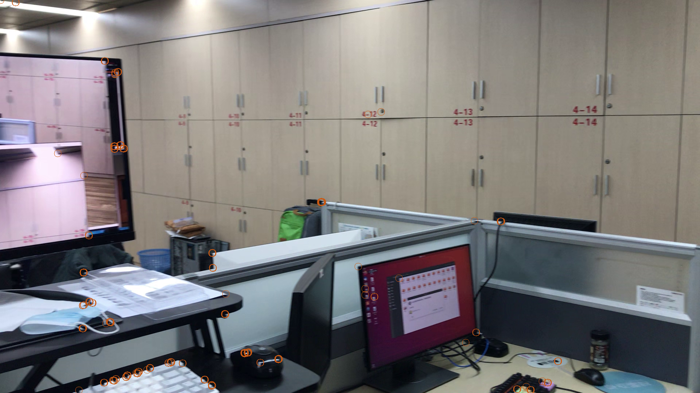
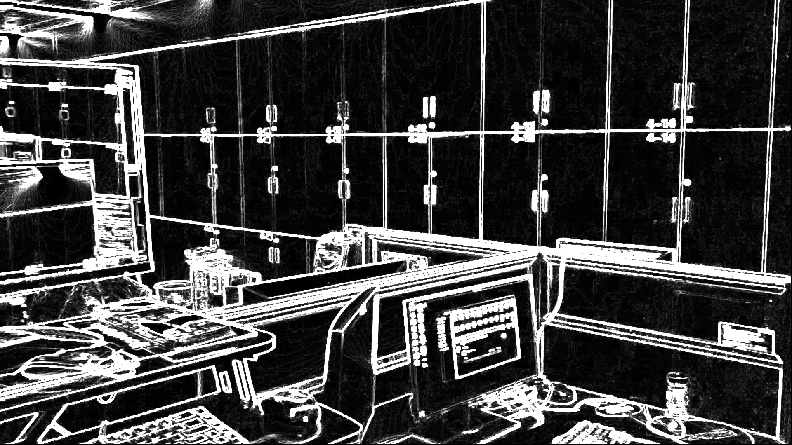
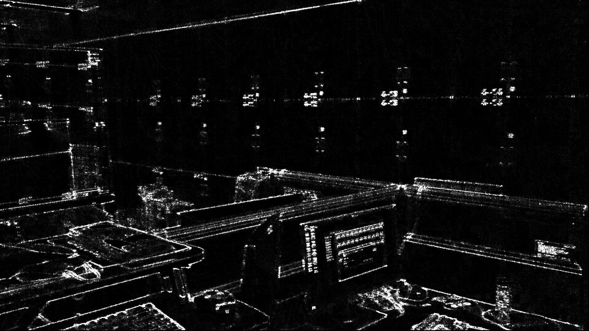
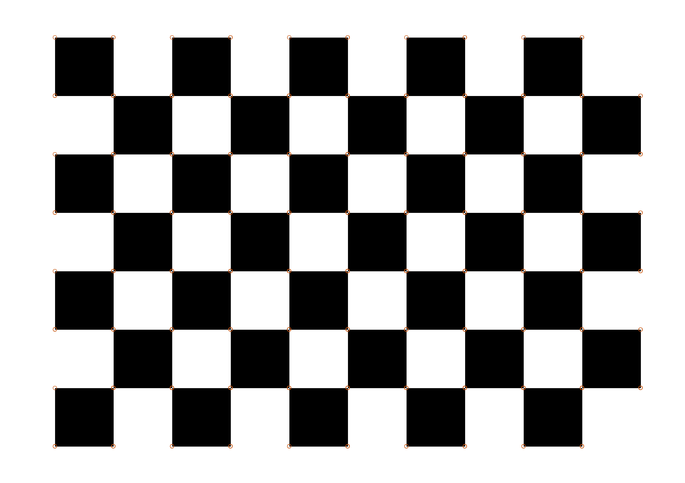
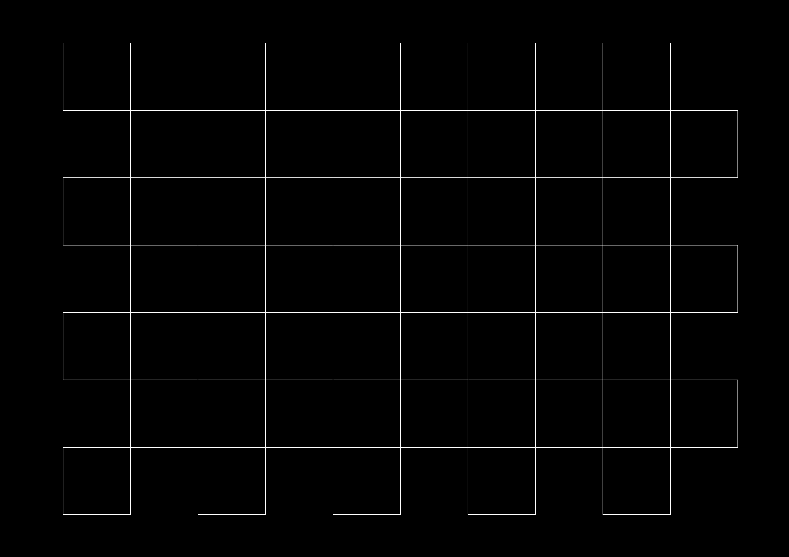

# Assignment 2

## 作业描述

读入摄像头, 回放视频.  按一下空格键则暂停回放, 并将当前帧图像做一次 Harris
Corner 检测, 并将检测结果叠加在原来的图像上.

## 使用方法

```bash
$ # 编译, 可执行文件为 build/harris
$ cd pa2/ && make
$ # 读入视频文件
$ ./build/harris media/lab.mov
$ # 或读入摄像头画面
$ ./build/harris /dev/video0
$ # 添加 flag `-i` 以处理图片
$ ./build/harris -i media/desktop.jpg
```

读取视频文件或摄像头画面时, 按空格后画面暂停, 并且将角点检测结果用橙色标注在图
像上.  按键盘 `q` 键退出.

## 测试结果

1. 检测结果: 
   最大特征值图: 
   最小特征值图: 
2. 检测结果: 
   最大特征值图: 
   最小特征值图: 
3. 检测结果: 
   最大特征值图: 
   最小特征值图: 

## 测试环境

OS: Arch Linux (5.9.14-zen1-1-zen)
cmake: 3.19.2
g++: 10.2.0
openmp: 11.0.0

> Author: Blurgy <gy@blurgy.xyz>
> Date:   Dec 26 2020, 21:45 [CST]
